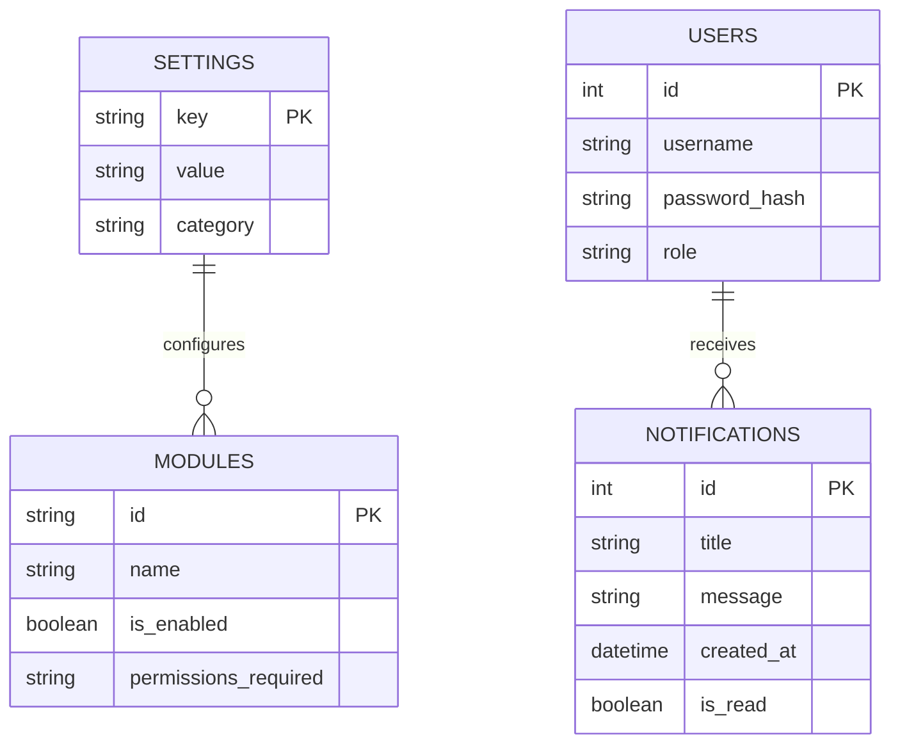

# Estrutura de Banco de Dados

O banco de dados oficial do **Area27 Tools** é o **SQLite**, devido à simplicidade de manutenção (arquivo único), alta performance de leitura e facilidade de backup.

## 🗃️ Tabelas Core

Estas tabelas mantêm as configurações base do sistema e a saúde operacional da plataforma.

### Detalhes das Tabelas de Módulos

Cada módulo pode registrar suas próprias tabelas ou usar chaves dinâmicas na tabela global de configurações (`settings`). A infraestrutura de dados suporta:

1. **`uptime_checks`**: Cadastro de URLs e IPs monitorados, protocolo de teste e frequência.
2. **`uptime_history`**: Registros de tempo de resposta e falhas para renderização de gráficos.
3. **`cameras`**: URLs RTSP, credenciais de acesso e configurações de canal.
4. **`devices`**: Inventário físico e descobertas da rede local (IP, MAC, Hostname).
5. **`backups`**: Histórico de rotinas executadas e status do envio para nuvem (S3/Drive).

## 🚀 Estratégia de Migração e Escalabilidade
- **EF Core Migrations**: Utilizaremos Migrations normais gerenciadas pelo Core.
- **Transição para PostgreSQL**: Se o projeto precisar crescer e ser hospedado de forma distribuída, a stack ASP.NET Core permite alterar o Provider do Banco de Dados em `Program.cs` com apenas uma linha de alteração, mantendo 95% do código SQL intacto.
