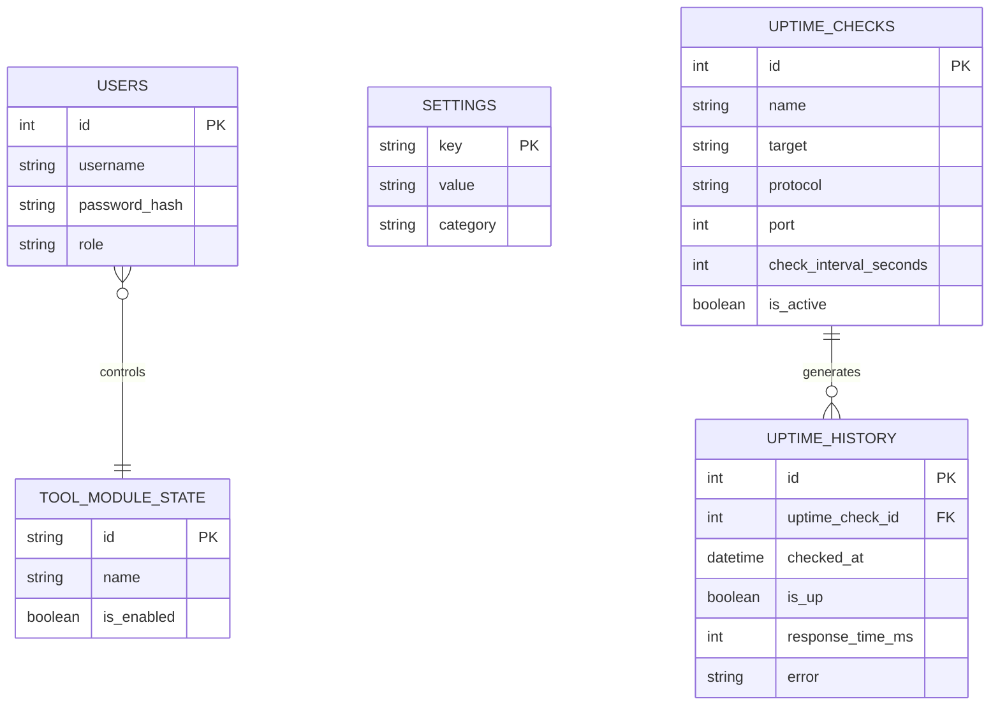

# Estrutura de Banco de Dados

O **Area27 Tools** suporta **SQLite** (padrão) e **PostgreSQL**. A seleção do provedor é feita via `"DatabaseProvider"` no `appsettings.json`.

## 🗃️ Tabelas do Sistema (Core)

Gerenciadas pelo `AppDbContext` em `Infrastructure/Data/AppDbContext.cs`:



## 📋 Todas as Tabelas Implementadas

| DbSet | Entidade | Módulo |
|---|---|---|
| `Users` | `User` | Core (Auth) |
| `Settings` | `Setting` | Core |
| `Modules` | `ToolModuleState` | Core (ModulesController) |
| `UptimeChecks` | `UptimeCheck` | Uptime |
| `UptimeHistories` | `UptimeHistory` | Uptime |
| `NetworkDevices` | `NetworkDevice` | NetworkScanner |
| `SslDomains` | `SslDomain` | SslDns |
| `BackupCronTasks` | `BackupCronTask` | BackupCron |
| `BackupCronLogs` | `BackupCronLog` | BackupCron |
| `GitRepositories` | `GitRepository` | GitDeploy |
| `LogSources` | `LogSource` | CentralizedLogs |
| `Cameras` | `Camera` | CameraPanel |
| `IotDevices` | `IotDevice` | IotMqtt |
| `InventoryItems` | `InventoryItem` | InventoryEvents |
| `Events` | `Event` | InventoryEvents |
| `EventChecklistItems` | `EventChecklistItem` | InventoryEvents |

> ⚠️ Não existe tabela `NOTIFICATIONS` — foi removida do escopo.

## 🗄️ Troca de Provedor (SQLite ↔ PostgreSQL)

Altere `appsettings.json`:
```json
{
  "DatabaseProvider": "postgresql",
  "ConnectionStrings": {
    "PostgreSQL": "Host=localhost;Port=5432;Database=area27_tools;Username=postgres;Password=changeme"
  }
}
```
O EF Core cria as tabelas automaticamente no restart via `context.Database.Migrate()` em `DbInitializer.Initialize()`.

## 🚀 Inicialização Automática
O `DbInitializer.Initialize()` garante:
1. `context.Database.Migrate()` — aplica migrations/cria schema
2. Seed do usuário admin padrão (`admin` / `admin`)
3. Seed do estado de todos os módulos (`ToolModuleState`)
