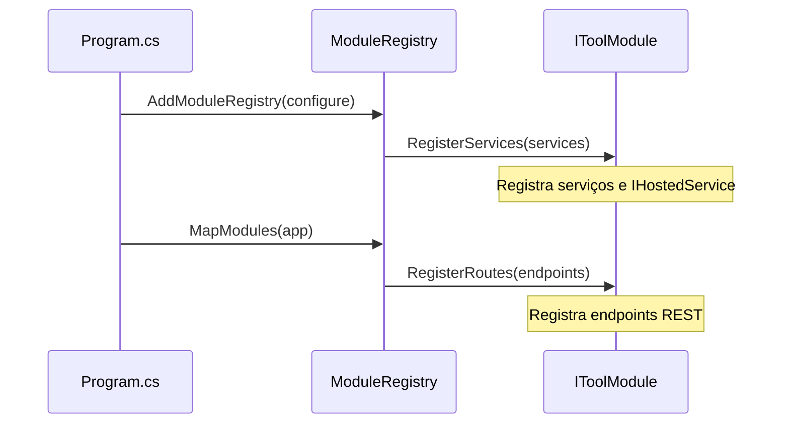

# Sistema de Módulos (IToolModule)

O core do **Area27 Tools** é projetado para ser o mais enxuto possível. Toda a lógica de negócio, APIs e serviços secundários são divididos em módulos que implementam a interface `IToolModule`.

---

## ⚙️ A Interface `IToolModule`

Definida em `Area27.Tools.Core/Modules/IToolModule.cs`:

```csharp
namespace Area27.Tools.Core.Modules;

public interface IToolModule
{
    // Metadados
    string Id { get; }
    string Name { get; }
    string Description { get; }
    string Icon { get; } // Nome do ícone Lucide correspondente no frontend

    // Configuração de Dependências (sem IConfiguration — use injeção de serviços)
    void RegisterServices(IServiceCollection services);

    // Registro de Endpoints (Minimal API)
    void RegisterRoutes(IEndpointRouteBuilder endpoints);

    // Serviços em Background
    IEnumerable<IHostedService> GetBackgroundServices();
}
```

> ⚠️ **Atenção**: `RegisterServices` **não** recebe `IConfiguration`. Injetar `IConfiguration` dentro de serviços via DI normal do ASP.NET Core.

---

## 📦 Localização dos Módulos

Os módulos ficam em `Backend/Area27.Tools.API/Modules/[NomeDoModulo]/`:

```
Area27.Tools.API/
└── Modules/
    ├── Uptime/
    ├── ServerMetrics/
    ├── NetworkScanner/
    ├── WebTerminal/
    ├── SslDns/
    ├── DockerManager/
    ├── BackupCron/
    ├── GitDeploy/
    ├── CentralizedLogs/
    ├── CameraPanel/
    ├── ReplaysQr/
    ├── IotMqtt/
    ├── InventoryEvents/
    └── Updater/          ← Fase 6
```

---

## 🔄 Registro em `Program.cs`

```csharp
builder.Services.AddModuleRegistry(registry =>
{
    registry.RegisterModule(new UptimeModule());
    registry.RegisterModule(new DockerManagerModule());
    registry.RegisterModule(new UpdaterModule());
    // ...
});
```

---

## 🔄 Ciclo de Vida e Inicialização



## 🛡️ Segurança
- Rotas exposta em `RegisterRoutes` devem chamar `.RequireAuthorization()` para exigir JWT.
- O estado de cada módulo (ativado/desativado) é gerenciado pela tabela `ToolModuleState` via `ModulesController`.
