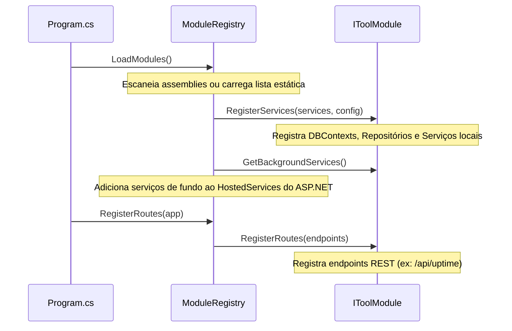

# Sistema de Módulos (IToolModule)

O core do **Area27 Tools** é projetado para ser o mais enxuto possível. Toda a lógica de negócio, APIs e serviços secundários são divididos em módulos que implementam a interface `IToolModule`.

---

## ⚙️ A Interface `IToolModule`

Definida no Core do sistema, a interface obriga a exposição dos seguintes metadados e hooks de inicialização:

```csharp
namespace Area27.Tools.Core.Modules;

public interface IToolModule
{
    // Metadados
    string Id { get; }
    string Name { get; }
    string Description { get; }
    string Icon { get; } // Nome do ícone Lucide correspondente no frontend
    
    // Configuração de Dependências
    void RegisterServices(IServiceCollection services, IConfiguration configuration);
    
    // Registro de Endpoints (Minimal API)
    void RegisterRoutes(IEndpointRouteBuilder endpoints);
    
    // Serviços em Background
    IEnumerable<IHostedService> GetBackgroundServices();
}
```

---

## 🔄 Ciclo de Vida e Inicialização

Durante a inicialização do ASP.NET Core (`Program.cs`), o carregador de módulos realiza as seguintes etapas:



## 🛡️ Segurança e Permissões
- Cada rota exposta em `RegisterRoutes` pode ser protegida com base em Claims de permissão expostas pelo módulo (ex: `uptime:write`, `docker:restart`).
- Se o módulo estiver desativado nas configurações globais (`settings`), o middleware bloqueia as rotas registradas por ele automaticamente.
