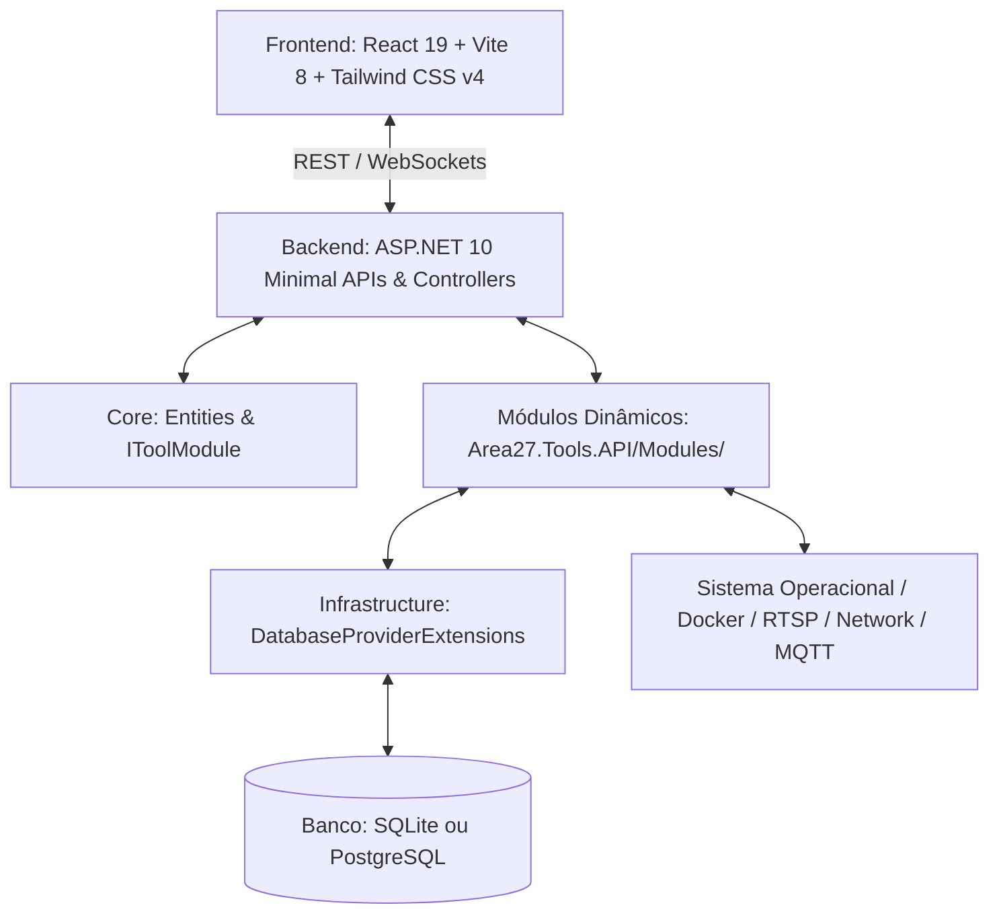

# Visão Geral da Arquitetura

Este documento descreve a infraestrutura conceitual e física adotada para o **Area27 Tools**.

## 🛠️ Stack Tecnológica

O sistema foi arquitetado para rodar de forma leve e performática em servidores Linux/Docker, ao mesmo tempo que provê uma interface moderna e multiplataforma.



### Backend: ASP.NET 10 (C#)
- **Minimal APIs & Controllers**: Endpoints otimizados, protegidos via JWT Bearer.
- **Background Services**: Uso nativo de `IHostedService` e `BackgroundService` para checagens de Uptime, rotinas de Backup e workers de background.
- **Database Abstraction**: Suporte a SQLite (padrão) e PostgreSQL configurável via `DatabaseProviderExtensions`.
- **Auto-Update**: Módulo `UpdaterModule` para checagem via GitHub Releases API.

### Frontend: React 19 + Vite 8
- **Tailwind CSS v4**: Para um design refinado, escuro por padrão (`#0b0c10` / `#1f2833`), com componentes de alta fidelidade e micro-animações.
- **Zustand v5**: Controle de estado global leve e reativo (persistência de layout e visibilidade de widgets via `localStorage`).
- **React Query v5**: Sincronização inteligente de dados em background e cache dos estados dos servidores e câmeras.

### Banco de Dados: SQLite / PostgreSQL
- **SQLite**: Gravação em arquivo único local (`area27_tools.db`), ideal para pequenas/médias instâncias.
- **PostgreSQL**: Suporte completo via `Npgsql.EntityFrameworkCore.PostgreSQL`, permitindo escalabilidade para ambientes maiores.

---

## 📁 Estrutura de Pastas Atual do Projeto

```
Area27.Tools/
├── Backend/
│   ├── Area27.Tools.slnx             # Arquivo de solução XML do .NET 10
│   ├── Area27.Tools.API/              # Controllers, Program.cs e Módulos
│   │   └── Modules/                  # Módulos isolados (Uptime, Docker, Updater, etc.)
│   ├── Area27.Tools.Core/             # Entidades de Domínio e IToolModule
│   └── Area27.Tools.Infrastructure/   # AppDbContext, DatabaseProviderExtensions, Security
└── Frontend/
    └── area27-ui/                     # Aplicação React 19 + Vite 8
        └── src/
            ├── components/            # Todos os Widgets e views (estrutura plana)
            └── store/                 # Zustand Stores (authStore, dashboardStore)
```
