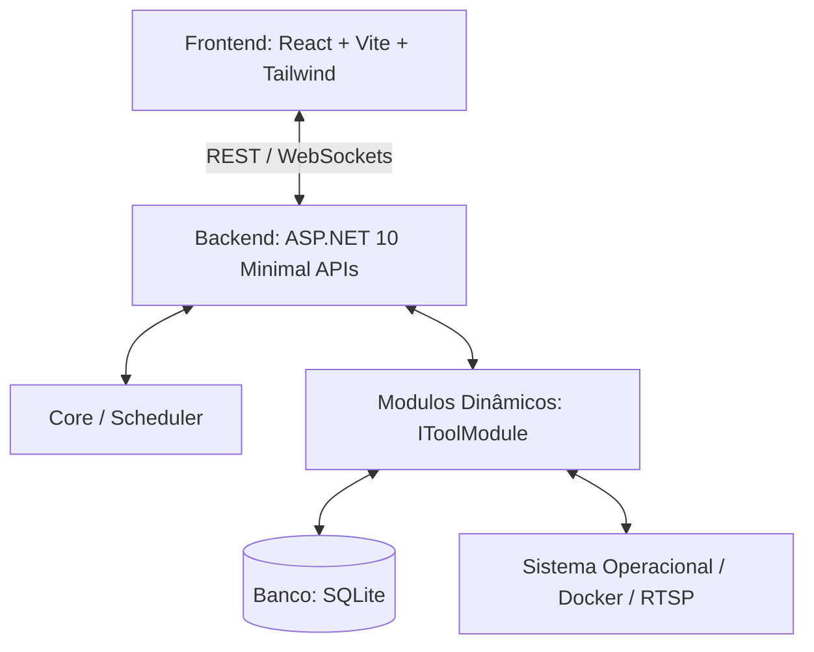

# Visão Geral da Arquitetura

Este documento descreve a infraestrutura conceitual e física adotada para o **Area27 Tools**.

## 🛠️ Stack Tecnológica

O sistema foi arquitetado para rodar de forma leve e performática em servidores Linux/Docker, ao mesmo tempo que provê uma interface moderna e multiplataforma.



### Backend: ASP.NET 10 (C#)
- **Minimal APIs**: Endpoints extremamente rápidos e com pouca sobrecarga (boilerplate).
- **Background Tasks**: Uso nativo de `IHostedService` e `BackgroundService` para checagens de Uptime, rotinas de Backup e escuta MQTT.
- **Single File Publish**: Possibilidade de compilar a aplicação em um executável autossuficiente único para facilitar a implantação em servidores.

### Frontend: React + Vite
- **Tailwind CSS & shadcn/ui**: Para um design refinado, escuro por padrão, com componentes de alta fidelidade e micro-animações.
- **Zustand**: Controle de estado global leve e reativo (especialmente útil para gerenciar a customização de widgets do Dashboard).
- **React Query**: Sincronização inteligente de dados em background e cache dos estados dos servidores e câmeras.

### Banco de Dados: SQLite
- **Simplificação**: Gravação em um arquivo único local, facilitando backups e replicação rápida de instâncias.
- **Compatibilidade**: Pode ser facilmente migrado para PostgreSQL caso o projeto cresça para um ambiente multi-inquilino complexo.

---

## 📁 Estrutura de Pastas Proposta

```
Area27.Tools/
├── Backend/
│   ├── Area27.Tools.slnx          # Arquivo de solução XML do .NET 10
│   ├── Area27.Tools.API/           # Inicialização, Middlewares e Injeção de Dependências
│   ├── Area27.Tools.Core/          # Abstrações base, Agendador, Notificações Globais
│   ├── Area27.Tools.Infrastructure/ # Acesso a Banco de Dados, Wrappers de OS e Docker
│   └── Area27.Tools.Modules/       # Implementação isolada de cada módulo
│       ├── Uptime/
│       ├── Cameras/
│       └── Docker/
└── Frontend/
    └── area27-ui/                  # React + Vite Application
```
